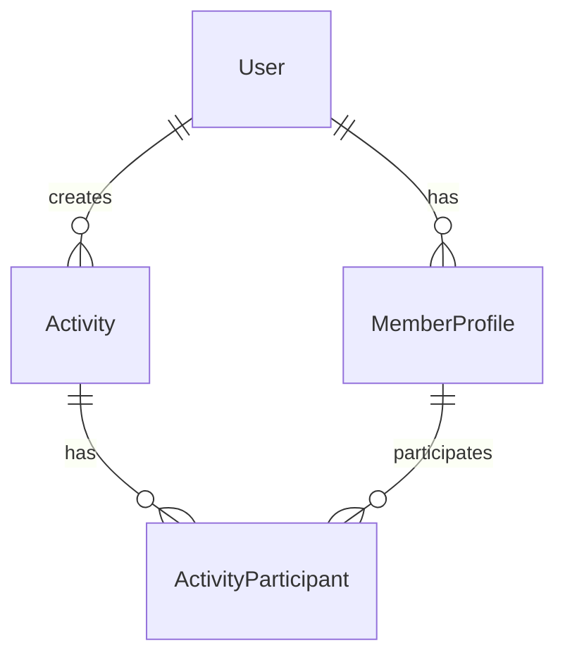

# 开发指南

欢迎来到 SVCG 社团管理系统开发指南！本指南将帮助您了解项目架构、开发规范和最佳实践。

## 项目架构

SVCG 采用前后端分离的现代化架构设计：

```
SeventhCenturyVideoGroup/
├── frontend/          # Vue 3 前端应用
├── backend/           # Go 后端服务
├── docs/             # VuePress 文档
└── deployment/       # 部署配置
```

### 技术选型

#### 前端技术栈

- **Vue 3**: 渐进式 JavaScript 框架
- **Vite**: 下一代前端构建工具
- **Arco Design**: 企业级 UI 组件库
- **Vue Router**: 路由管理
- **Pinia**: 状态管理
- **Axios**: HTTP 客户端

#### 后端技术栈

- **Go**: 高性能编程语言
- **Echo**: 轻量级 Web 框架
- **GORM**: Go 语言 ORM
- **SQLite**: 嵌入式数据库
- **JWT**: 身份认证

## 开发环境设置

### 1. 前端开发环境

```bash
cd frontend
npm install
npm run dev
```

开发服务器将在 `http://localhost:5173` 启动，支持热重载。

### 2. 后端开发环境

```bash
cd backend/go-echo-sqlite
go mod download
go run main.go
```

API 服务将在 `http://localhost:8080` 启动。

## 代码规范

### 前端代码规范

#### 文件命名
- 组件文件使用 PascalCase: `UserProfile.vue`
- 页面文件使用 PascalCase: `MemberLogin.vue`
- 工具文件使用 camelCase: `auth.js`

#### 代码风格
```javascript
// ✅ 推荐
const getUserInfo = async (userId) => {
  try {
    const response = await api.get(`/users/${userId}`)
    return response.data
  } catch (error) {
    console.error('获取用户信息失败:', error)
    throw error
  }
}

// ❌ 不推荐
function getUserInfo(userId){
    return api.get("/users/"+userId).then(res=>res.data)
}
```

#### Vue 组件规范
```vue
<template>
  <div class="user-profile">
    <h1>{{ title }}</h1>
    <user-avatar :src="user.avatar" />
  </div>
</template>

<script setup>
import { ref, computed } from 'vue'
import UserAvatar from './UserAvatar.vue'

// Props 定义
const props = defineProps({
  user: {
    type: Object,
    required: true
  }
})

// 响应式数据
const title = ref('用户资料')

// 计算属性
const displayName = computed(() => {
  return props.user.nickname || props.user.username
})
</script>

<style scoped>
.user-profile {
  padding: 20px;
}
</style>
```

### 后端代码规范

#### 文件结构
```
backend/go-echo-sqlite/
├── main.go              # 入口文件
├── config/              # 配置文件
├── controllers/         # 控制器
├── models/             # 数据模型
├── routes/             # 路由定义
└── middleware/         # 中间件
```

#### 代码风格
```go
// ✅ 推荐
func GetUserProfile(c echo.Context) error {
    userID := c.Param("id")
    
    var user models.User
    if err := db.First(&user, userID).Error; err != nil {
        return c.JSON(http.StatusNotFound, map[string]string{
            "error": "用户不存在",
        })
    }
    
    return c.JSON(http.StatusOK, user)
}

// ❌ 不推荐
func getUserProfile(c echo.Context) error{
    id:=c.Param("id")
    var user models.User
    db.First(&user,id)
    return c.JSON(200,user)
}
```

## 数据库设计

### 主要实体

#### 用户表 (users)
```sql
CREATE TABLE users (
    id INTEGER PRIMARY KEY AUTOINCREMENT,
    username VARCHAR(50) UNIQUE NOT NULL,
    email VARCHAR(100) UNIQUE NOT NULL,
    password_hash VARCHAR(255) NOT NULL,
    created_at DATETIME DEFAULT CURRENT_TIMESTAMP,
    updated_at DATETIME DEFAULT CURRENT_TIMESTAMP
);
```

#### 成员资料表 (member_profiles)
```sql
CREATE TABLE member_profiles (
    id INTEGER PRIMARY KEY AUTOINCREMENT,
    user_id INTEGER NOT NULL,
    real_name VARCHAR(100),
    phone VARCHAR(20),
    major VARCHAR(100),
    join_year INTEGER,
    FOREIGN KEY (user_id) REFERENCES users(id)
);
```

### 数据关系



## API 设计

### RESTful API 规范

- 使用标准 HTTP 方法
- 统一的响应格式
- 合理的状态码使用
- 清晰的错误消息

#### 标准响应格式
```json
{
  "success": true,
  "data": {
    "id": 1,
    "username": "user001"
  },
  "message": "操作成功"
}
```

#### 错误响应格式
```json
{
  "success": false,
  "error": {
    "code": "VALIDATION_ERROR",
    "message": "输入数据验证失败",
    "details": {
      "username": "用户名不能为空"
    }
  }
}
```

## 状态管理

### Pinia 使用规范

```javascript
// stores/user.js
import { defineStore } from 'pinia'

export const useUserStore = defineStore('user', {
  state: () => ({
    userInfo: null,
    isLoggedIn: false
  }),
  
  getters: {
    displayName: (state) => {
      return state.userInfo?.nickname || state.userInfo?.username || '游客'
    }
  },
  
  actions: {
    async login(credentials) {
      try {
        const response = await authAPI.login(credentials)
        this.userInfo = response.data.user
        this.isLoggedIn = true
        return response
      } catch (error) {
        this.logout()
        throw error
      }
    },
    
    logout() {
      this.userInfo = null
      this.isLoggedIn = false
      // 清除本地存储的令牌
      localStorage.removeItem('auth_token')
    }
  }
})
```

## 测试规范

### 前端测试

使用 Vitest 进行单元测试：

```javascript
// tests/components/UserProfile.test.js
import { mount } from '@vue/test-utils'
import { describe, it, expect } from 'vitest'
import UserProfile from '@/components/UserProfile.vue'

describe('UserProfile', () => {
  it('正确显示用户信息', () => {
    const user = {
      id: 1,
      username: 'testuser',
      nickname: '测试用户'
    }
    
    const wrapper = mount(UserProfile, {
      props: { user }
    })
    
    expect(wrapper.text()).toContain('测试用户')
  })
})
```

### 后端测试

使用 Go 内置测试工具：

```go
// controllers/user_test.go
func TestGetUserProfile(t *testing.T) {
    e := echo.New()
    req := httptest.NewRequest(http.MethodGet, "/api/users/1", nil)
    rec := httptest.NewRecorder()
    c := e.NewContext(req, rec)
    c.SetParamNames("id")
    c.SetParamValues("1")
    
    if assert.NoError(t, GetUserProfile(c)) {
        assert.Equal(t, http.StatusOK, rec.Code)
    }
}
```

## 部署准备

### 构建生产版本

#### 前端构建
```bash
cd frontend
npm run build
```

#### 后端构建
```bash
cd backend/go-echo-sqlite
go build -o svcg-server main.go
```

## 开发工作流

1. **功能开发**: 从 `main` 分支创建特性分支
2. **代码提交**: 遵循约定式提交规范
3. **代码审查**: 创建 Pull Request 进行代码审查
4. **测试验证**: 确保所有测试通过
5. **合并部署**: 合并到 `main` 分支并部署

## 下一步

- 📱 [前端开发详细指南](./frontend/)
- ⚙️ [后端开发详细指南](./backend/)
- 🗄️ [数据库操作指南](./database.md)
- 🧪 [测试指南](./testing.md)
